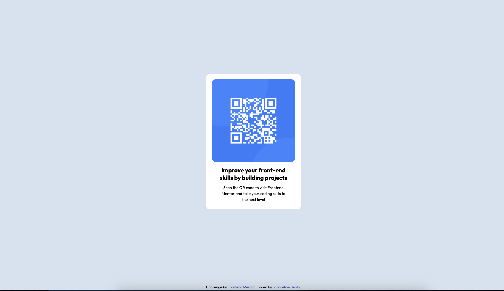
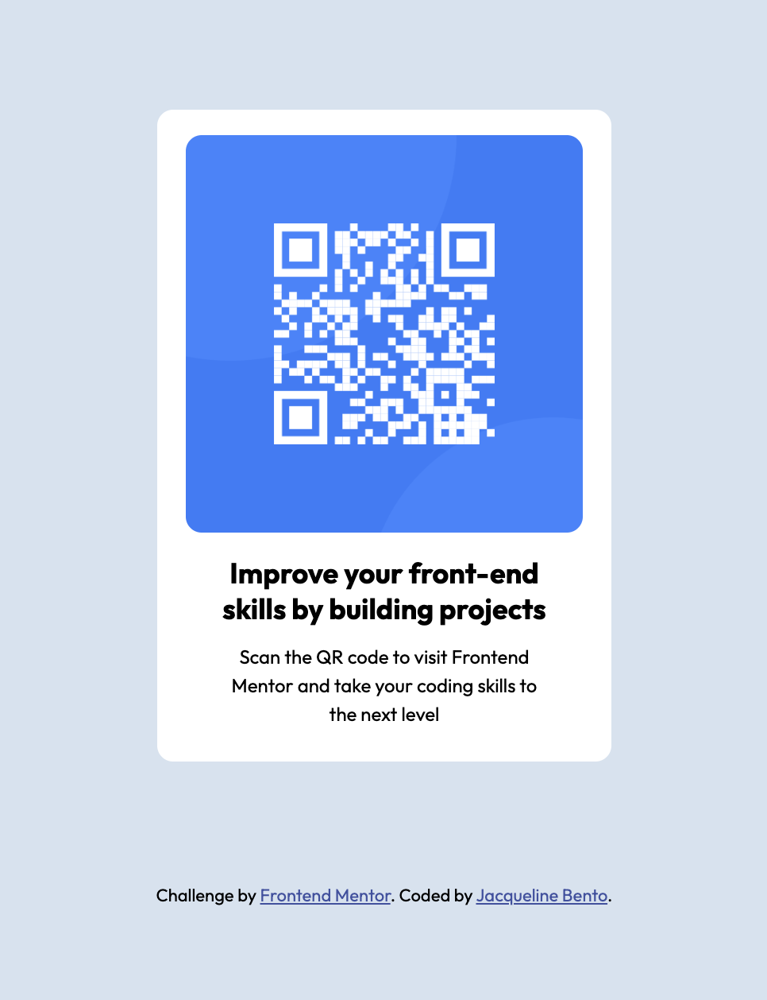

# Frontend Mentor - QR code component solution

This is a solution to the [QR code component challenge on Frontend Mentor](https://www.frontendmentor.io/challenges/qr-code-component-iux_sIO_H). 

## Table of contents

- [Overview](#overview)
  - [Screenshot](#screenshot)
  - [Links](#links)
- [My process](#my-process)
  - [Built with](#built-with)
  - [What I learned](#what-i-learned)
  - [Continued development](#continued-development)
  - [Useful resources](#useful-resources)
- [Author](#author)
- [Acknowledgments](#acknowledgments)

**Note: Delete this note and update the table of contents based on what sections you keep.**

## Overview

### Screenshot

### Links

- Solution URL: [Add solution URL here](https://github.com/jacquebento/qr-code)
- Live Site URL: [Add live site URL here](https://jacquebento.github.io/qr-code/)

## My process
I followed the first instructions, review the material provided, created the structure for the HTML, applied styles in CSS.

### Built with

- Semantic HTML5 markup
- CSS custom properties

### What I learned

I learned how to create a page following design and styles provided.

### Continued development

It was very instructional the exercise to replicate a page, I look foward to practice more using the same method.

### Useful resources

## Author

- Jacqueline Bento

